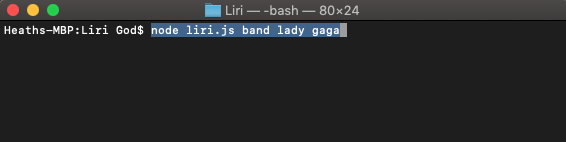
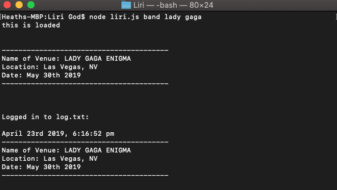
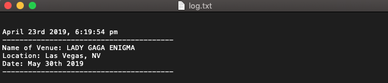

# Liri

Liri a command line based program that takes in two arguments (task, search) using Node.js and NPM packages (Moment, Axios, Node-Spotify-API, fs)

# **All possible task arguments:**

The 'song' argument guides the 'search' argument in to the Node-Spotify-API 

The 'band' argument guides the 'search' argument in to the Axios function that searches the 'Bands In Town' API

The 'movie' argument guides the 'search' argument in to the Axios function that searches the 'OMDB' API

The 'do' argument fires off the 'fs' function that begins to read the 'random.txt' folder provided, then uses conditionals to determine the first and second argument.

# **All possible search arguments**

The 'search' argument is based on what you'd like to search relevant to the 'task' argument.

# **Example**

